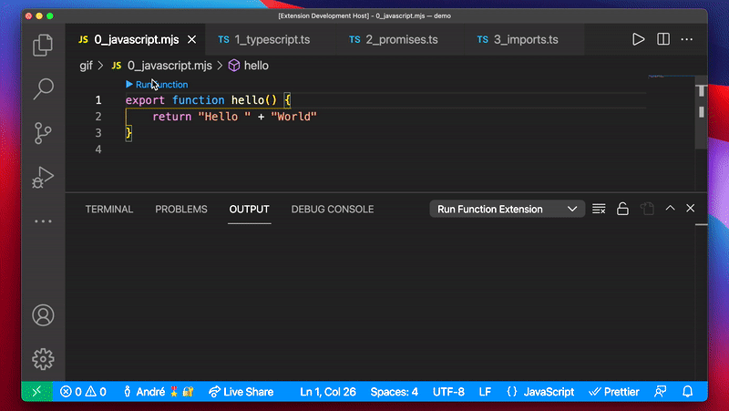

# ► Run Function

Run JavaScript and TypeScript functions with one click!

When writing a new function, how do you quickly verify it's working properly? Stop creating temporary files just to test a function, or getting repl import errors. With the Run Function VS Code extension, you can just click one button on exported functions to run them directly within VS Code!



## Features

-   Displays a **`► Run Function`** button above exported functions
-   Click the button to immediately run the function
-   Returned values are printed in the Output View, along with logs and errors
-   Dependencies are imported properly
-   Supports `.mjs`, `.ts` and `.tsx` files
-   Auto saves the file to run the function

## How does it work

This extension uses `child_process.spawn` to invoke `node` or `ts-node`, and execute a script similar to this:

```js
import("./myFile") // Imports your file dynamically
    .then((m) => m.myFunction()) // Calls your function
    .then((v) => console.log(JSON.stringify(v))) // Logs the returned value
    .catch((e) => console.error(e)); // Logs errors
```

## Extension Settings

This extension contributes the following settings:

-   `run-function.buttonDisplay`: Defines how to display the button to run the function.
    -   `icon and text above`: Displays a \"► Run Function\" button above the function
    -   `icon above`: Displays a \"►\" icon button above the function
    -   `none`: No button is displayed

## Limitations

-   Function Arguments aren't supported **yet**
-   `.js` and `.jsx` files aren't supported **yet**
-   Only supports exported function
-   Browser APIs might not work, since it uses `node` to run them
-   VS Code doesn't support ANSI colors on the Output view
-   Function detection depends on a regex, instead of the code's AST

## Future Work and Ideas

-   [ ] Support `.js` and `.jsx` files
-   [ ] Function Parameters
-   [ ] Add an option to enable TypeScript type checking (disabled for a ~3x quicker transpilation)
-   [ ] Add an option to change auto-save behavior
    -   Auto-save: Saves the file when "► Run function" is clicked. This should also print "Auto saved" in the console
    -   Ask: Shows a dialog to offer saving the file
    -   Temp file: Creates a temp file in the same folder and executes that instead. Might have problems if other files require the file (circular references)
    -   Don't save: Doesn't save the file. Executes the saved file. Should notify the user that it's executing the unsaved version
-   [ ] Add a VSCode command (Cmd+Shift+P) to run the current function
-   [ ] Color the output
-   [ ] Add an option to run the function in the terminal
-   [ ] Add an option to display an execution icon inline, instead of above the functions
-   [ ] Add an option to create a keyboard shortcut to execute the function
-   [ ] Add an option to customize TypeScript Compile Options
-   [ ] Display a webview with an interactive way of visualizing the data. Useful for objects (with a tree view), or lists (with a table view)

## Developing

-   Run `yarn install` in terminal to install dependencies
-   Run the `Run Extension` target in the Debug View. This will:
    -   Start a task `npm: watch` to compile the code
    -   Run the extension in a new VS Code window
